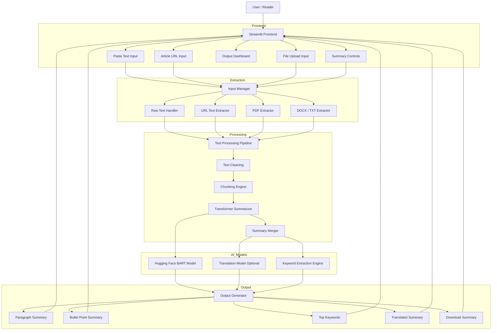

# 🧠 AI Text Summarizer Pro  
### 🚀 Smart Document Intelligence & Content Summarization Platform  

  
  
  
  

  

---

## 🌟 Overview

AI Text Summarizer Pro is an intelligent NLP-powered application that converts long-form content into concise and meaningful summaries.

It helps users process and understand large amounts of information from:

- 📰 News articles  
- 📚 Blogs  
- 📄 Research papers  
- 📂 PDF, DOCX, TXT files  

This project demonstrates practical implementation of:
- Natural Language Processing (NLP)  
- Transformer-based AI models  
- Document intelligence systems  
- Interactive AI web applications  

---
## 🏗️ Architecture Diagram

---

## ✨ Why This Project Is Useful

In today’s world, information overload is a major challenge.

This application helps by:
- ⏱️ Reducing reading time  
- 🧠 Extracting key insights quickly  
- 📈 Improving productivity  
- 📉 Reducing cognitive load  

### Ideal for:
- 📚 Students  
- 🔬 Researchers  
- 💻 Engineers  
- 📊 Professionals  

---

## 🎯 Core Features

### ✍️ Multi-Input Support
- Paste text directly  
- Extract content from URLs  
- Upload PDF, DOCX, TXT files  

### 🧠 AI-Powered Summarization
- Uses Hugging Face transformer models  
- Generates high-quality summaries  
- Handles long content using chunking  

### 🎛️ Flexible Summary Modes
- Short  
- Medium  
- Detailed  

### 📌 Output Options
- Paragraph format  
- Bullet-point summaries  

### 🌐 Translation Support
- Translate summaries into multiple languages  

### 🔑 Keyword Extraction
- Automatically extracts important keywords  

### 📥 Export Features
- Download summary as text  
- Easy copy functionality  

---

## ⚡ Key Highlights

- Built using state-of-the-art Transformer models  
- Handles long documents efficiently  
- Multi-input intelligent system  
- Clean and interactive UI  
- Real-world applicable NLP project  

---

## ⚙️ How It Works

1. User provides input (text, URL, or file)  
2. Text is extracted and cleaned  
3. Content is split into manageable chunks  
4. Transformer model generates summaries  
5. Output is formatted and enhanced  
6. Keywords and translations are applied  
7. Final result is displayed and downloadable
   
---

##🛠️ Tech Stack
| Category          | Tools Used                |
| ----------------- | ------------------------- |
| 🧠 AI / NLP       | Hugging Face Transformers |
| 🔥 Language       | Python                    |
| 🎨 UI             | Streamlit                 |
| ⚙️ ML Framework   | PyTorch                   |
| 🌐 Web Extraction | Trafilatura               |
| 📄 File Handling  | pypdf, python-docx        |
| 📊 Processing     | Scikit-learn              |

---

## 📌 Example Use Cases

- 📚 Summarizing research papers quickly  
- 📰 Getting insights from long articles  
- 🧾 Analyzing reports efficiently  
- 💻 Understanding documentation faster  
- 📊 Extracting business insights  

---

## 🔮 Future Enhancements

- 📄 OCR support for scanned PDFs  
- 🤖 Chat with document  
- 📊 Dashboard analytics  
- ☁️ Cloud deployment  
- 🔐 User authentication  
- 🧠 Multi-document summarization  

---

## 🏆 Why This Project Stands Out

- Complete end-to-end AI application  
- Combines NLP, UI, and file processing  
- Solves real-world problem  
- Scalable and extensible design  

---

## 👨‍💻 Author

**Rohan Ramgopal**

